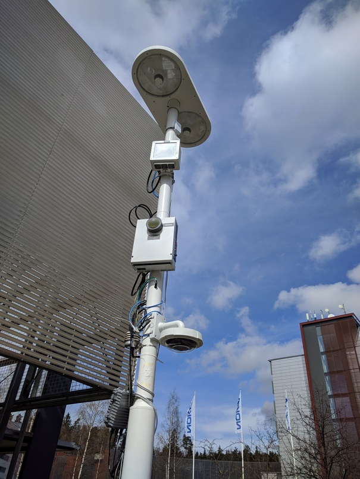

MEC description for Junction + ETSI MEC Hackathon
===================================================

Introduction
-------------

This document describes the setup and use of the µMEC blueprint for the Junction and Akraino MEC Hackathon.

The use case is enabling smart cities: The µMEC is a small server that can be installed on e.g. on a lightpole. It can have different sensors, such as cameras, temperature sensors, air quality sensors etc. The camera is probably the most interesting item. 

It is possible to use different Machine Learning models on the µMEC; however, for now we are using Raspberry Pis as the hardware. Therefore, the performance is not great. Going forward, we are looking into improving this by using hardware that supports machine learning better.



As for the services on µMEC, there are two (or three models):

1. Use the µMEC to collect information and then store the information on a database. This is enabled in the hackathon setup; instructions are below.

2. Run a local application on the µMEC. This allows the user to interact directly with the application.

3. Use the µMEC as an access point only and go directly to a server.

```

     ┌────────┐      ┌──────────────────────────────┐
     │end user│      │ µMEC     ┌───────┐           │    ┌────────────────┐
     │        │      │   ┌───┐  │MEC11  │           ├────│Developer portal│
     │        │      │   │App│  │service│ ┌────────┐│    └────────────────┘
     │        ├──────┤   └───┘  └───────┘ │OpenFAAS││ 
     │        │      │   ┌───┐  ┌───────┐ └────────┘│
     │        │      │   │DNS│  │kubectl│           ├──── Internet
     │        │      │   └───┘  └───────┘           │         │
     └────────┘      └─────────────┬────────────────┘   ┌─────┴────────┐
                               ┌───┴──┐                 │OpenFAAS cloud│
                               │camera│                 └──────────────┘
                               └──────┘                  
```

The system has a number of nodes that together form a Kubernetes cluster. We are using k3s which is a somewhat lighter version of Kubernetes but is compatible with Kubernetes. We are using the Kubernetes provided DNS server. On top of k3s, we have OpenFAAS.

OpenFAAS is an implementation of "Function as a Service" which simplifies application development: instead of creating an application that runs in a container (or virtual machine) and provides a REST interface, with OpenFAAS one can simply write the function and the infrastructure takes care of the rest: creating a container and exposing the function as a REST interface.

The OpenFAAS works very well together with ETSI MEC (Multi-Access Edge Computing).


Hardware setup
---------------

The hardware consists of three Raspberry Pis that are configured as a cluster. They are all connected to the same WLAN network which in turn is connected to the Internet. 


Key components
---------------

The 


App developer view
-------------------


Example app: Hello, world!
---------------------------


Detailed instructions
---------------------

